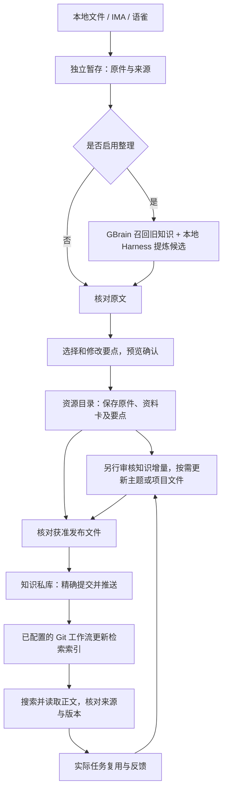

# 知识库使用与流转

这份说明面向已经打开门户的人。第一次安装请先看[快速开始](快速开始.md)和[从零搭建操作手册](从零搭建操作手册.md)；配置字段及格式限制见[门户说明](../portal/README.md)。

## 先弄清楚：内容在哪里

知识库是你自己的 Markdown 文件夹。Obsidian、门户和 Agent 读取同一份文件，停止门户不会删除知识。GBrain 是可重建的检索索引，不是正文主库。

| 位置 | 放什么 | 什么时候更新 |
|---|---|---|
| 独立暂存目录 | 上传原件、解析结果、整理候选、未确认任务 | 导入和审核时 |
| `00_资源库` | 已确认保存的原件、来源资料卡及保留要点 | 点击确认保存后 |
| `01_主题Wiki` | 已审核的通用方法与经验 | 单独审核具体正文或差异后 |
| `02_项目库` | 项目背景、约束、决策与案例 | 单独审核后 |
| `03_输出库` | 正式方案、复盘、评测等成果 | 单独审核后 |
| `04_系统维护` | 模板、使用约定、反馈与私有实例记录 | 按对应维护流程 |
| 知识私库与 GBrain | 获准共享的 Git 版本、获准检索的索引 | Git 推送及刷新成功后 |

**三件事分开看：保存到本机、推送到远程、更新搜索索引。** 前一件完成，不代表后一件也完成。

## 页面分别用来做什么

| 菜单 | 你可以做什么 |
|---|---|
| 知识库 | 阅读当前本地文件；用目录按文件名定位；在 Obsidian 编辑后点击“刷新”查看 |
| 搜索知识 | 在已经发布的索引中搜索关键词或问题；打开本地正文或展开索引原文对照 |
| 关系图谱 | 查看文档之间明确写出的链接；拖动、缩放、筛选，点击节点打开正文 |
| 本地文件 | 上传一份 Markdown、Word DOCX 或文字版 PDF |
| IMA | 浏览个人知识库、收藏资料或笔记，选择一篇导入 |
| 语雀 | 配置自己的 Token 后，按完整文档链接读取一篇 |
| 模型渠道 | 选择已安装的 Codex 或 DeepSeek Harness，检测运行情况 |

菜单切换不会重载整个网页，未保存的输入和审核草稿在当前页面内保留，浏览器前进、后退可用。关闭标签、重载页面或停止服务后，未保存的编辑不能靠这项功能恢复；已暂存的任务可以从“继续整理”重新打开。

## 第一次选择 AI 助手

Harness 指本机 AI 助手的执行程序，不是另一个知识库。

1. 在本机安装并登录你要使用的 Codex 或 DeepSeek Harness。门户不会自动安装它们。
2. 打开“模型渠道”，选择显示已安装的工具，点击“使用此 Harness”。
3. 需要核对连接时点击“测试运行”。它只发送固定测试文字，不读取资料。
4. 回到导入页，确认“帮我整理值得记住的内容”可用。

未检测到程序时，核对门户启动进程的 PATH，或按[门户配置](../portal/README.md)填写已经安装的程序路径。认证、账户和模型设置在对应 Harness 内处理；门户不再提供模型 API Key 表单。Codex 本次任务忽略用户自定义配置，使用原生默认模型；DeepSeek Harness 沿用本机默认模型配置。

本地调用仍可能连接云端并产生用量。导入时会说明本篇正文和旧知识片段的发送范围，确认后才处理；不应将“本地程序”理解为完全离线。没有可用工具，或不希望 AI 处理，可以取消自动整理，仅导入原文。

## 导入一份本地资料

1. 打开“本地文件”，在“添加新资料”选择文件。Markdown 上限 4 MiB；DOCX / PDF 上限 16 MiB，后两者需先安装解析依赖。
2. 填写主题分类，例如“Java/性能”；标题和来源说明可选。尽量保留原文章链接或出处。
3. 选择是否自动整理，点击“导入资料”。开启整理时核对弹窗中的工具和资料范围。
4. 等待结果，展开“查看原文与读取范围”，检查缺失内容、格式警告和来源；必要时下载原件对照。
5. 在要点列表中勾选值得保留的内容，可直接修改标题和文字，也可全部不选。
6. 点击“下一步：确认保存内容”，核对分类、具体要点及原件清单。此时仍只保存到暂存区。
7. 勾选“我已核对上述内容”，点击“确认存入本地知识库”。出现保存成功后，可以打开已保存内容。

保存的要点追加在同一份 `原始资料卡.md` 中；Word / PDF 还会保存解析正文及提取到的图片。**这一步不会自动建立独立知识卡、修改旧 Wiki 或提交 Git。** 要把结论补进某篇主题或项目知识，继续走下文的“整理成长期知识”。

文件支持范围与自动整理范围不同：解析成功的长文可能超出自动整理的 32000 字符 / 128 KiB 限制。系统不会静默截断发送；可拆分后再处理，或保留原文并人工审核。扫描页只标记需要识别，不进行 OCR；复杂版式需要对照原件。

## 从 IMA 或语雀导入

### IMA：区分“知识库”与“笔记”

- 收藏的网页、上传文件等“个人知识”：选择“知识库 · 含个人知识”，点击“加载知识库”，选择接口返回的个人库。关键词留空可浏览，填写关键词可搜索；文件夹可进入，列表可翻页。
- IMA 笔记：切换“笔记”，输入标题关键词。筛选的是接口当前返回页，不是个人收藏资料全文。
- 选中一篇资料、填写分类，再点击导入。之后沿用同样的原文核对、要点选择和确认保存步骤。

未看到目标时先检查来源选择、库、文件夹和分页。订阅库可见不代表允许下载；访问验证页、受限资料或不支持格式可从 IMA 客户端导出，再用本地导入。凭据缺失或 HTTP 401 时，更新[门户说明中的 IMA 凭据](../portal/README.md)，确保重启后的进程读取到新值。

需要检查已有资料变化时，从“继续整理”打开原 IMA 任务，点击“检查 IMA 更新”。当前支持待确认或已发布并验收的任务；仅本地保存的任务需先完成原发布核对流程。核对改名时，先在列表选中同一篇。变化会生成新的待审草稿，旧资料不会被覆盖；原 Markdown 文件和后来复制到笔记里的内容属于不同来源，不能仅凭标题认定是同一份资料。本功能不会定时同步。

### 语雀：有 API 权限才使用在线入口

在“连接语雀”填写自己的 Token，再粘贴完整文档链接并选择分类。Token 相当于调用文档接口的凭据，不是登录密码；不要把它贴进知识正文或 Git。账号是否可以创建及使用 Token，以账号实际开放 API 权限为准，本项目不要求为此购买会员。暂时无法使用时，导出 Markdown / DOCX 后走本地导入即可。

当前只支持普通单篇文档，不做知识库全文搜索、批量同步或写回。语雀真实账号验收仍暂缓；钉钉未接入。

## AI 整理与 Codex 对话有什么区别

| 项目 | 网页导入后的整理 | Codex 对话里的知识流程 |
|---|---|---|
| 触发 | 导入时勾选整理，或点“重新整理” | 按业务任务范围查询；成果完成且有经验线索才评审 |
| 执行者 | 门户后端启动已选本地 Harness | 宿主主 Agent 调用原生查询、评审两个子 Agent |
| 对照范围 | 按资料标题检索，最多 3 份版本一致的旧知识片段 | 最相关的 1～2 份原文，不作全库覆盖保证 |
| 结果 | 可编辑、可选择的资料要点 | 一条简短候选；用户选中后才整理正文或精确差异 |
| 写入 | 页面确认后保存资源资料包 | 用户确认具体内容后，由原流程写入目标知识文件 |

**上传后无需再去 Codex 对话中发一句话才能整理。** 门户已有自己的处理入口，也不借当前聊天会话执行任务。两个入口的确认范围分别成立，不能把一处批准当作另一处的无限写入授权。

网页中的“已有相近内容”“与已有知识有分歧”等是本次有限对照的建议，不是全库去重结论。正文摘录匹配只能证明有文本依据，不能证明结论正确。搜索服务失败时仍保留已导入原件，不把失败当作“没有旧知识”。

## 整理成长期知识

资料归档后，可在 Codex 中明确提出：

```text
请读取我指定的这份原始资料卡和原文，判断哪些内容值得进入主题或项目知识。
检索并读取最相关的一至两份已有知识，先给一条简短候选，包含增量、来源、适用边界和目标路径。
我选中候选后，再展示完整拟写正文或精确差异；我确认正文后再保存，不覆盖原件。
不要因为资料已归档，就把资料中的结论全部标为已验证。
```

有相近知识时优先补充或纠偏；项目内经验可以保留为项目案例；没有增量就跳过。资料卡的归档批准与通用方法的事实审核不同，网页不会自动把原件和资料卡的状态全改成 `approved`。

## 从保存到可以搜索：完整流转



1. 在**知识目录自己的仓库**核对将要共享、索引的文件及完整待推送提交，不能用应用仓库代替。
2. 精确提交已经确认的文件，并推送到已配置的知识私库发布分支。仅本地 commit 不会触发远程刷新。
3. 若已安装 Git 自动刷新工作流，等待本次提交的任务完成；没有安装时，按实例记录的原有刷新方式执行。推送本身不会凭空建立索引服务。
4. 在“搜索知识”或新 Codex 会话中搜索，读取原文，核对来源和版本。工作流绿色并不自动证明搜到的就是本次内容。

网页没有同步按钮。需要沿用门户任务进度时，通过“高级信息与原有审核方式”导出交接任务，再使用[独立发布命令](../portal/README.md)。`publish` 需要当前版本的实际批准回执；`check` 核对工作流、刷新回执和索引；`retry` 只重试对应失败工作流。已有原生 Git 工作流也可继续使用，但自行提交推送不会自动把门户任务标为“已发布并验收”。

共享范围与索引范围应在搭建时确定：默认不索引原件、草稿、模板和实例记录。如明确需要搜索资源资料卡或解析正文，必须另行批准这些具体文件并配置过滤规则；不要为了让它“搜得到”而放开整个资源库。

## 中断后从哪里继续

| 看到的状态 | 下一步 |
|---|---|
| 资料已暂存 / 待你确认 | 从“继续整理”选中任务，核对原文并审核 |
| 排队 / 正在整理 | 可切换菜单；离开页面不等于取消后端任务，需要停止时点“取消整理” |
| 整理失败或进程中断 | 原件仍在；核对工具、搜索服务、长度限制，再决定重新整理或仅保存原文 |
| 保存未完成 | 核对提示和当前版本，通过原确认流程恢复；不要另建同名目标覆盖 |
| 已存入本地知识库 | 已可本地阅读；远程同步与搜索仍按 Git 流程处理 |
| 已推送 / 刷新失败 | 查本次工作流与回执，只恢复刷新，不重复导入或重写已保存文件 |
| 已发布并验收 | 表示发布适配已完成版本及索引检查；后续修改需要新的审核和发布 |

## 常见疑问

- **刚保存怎么搜不到？** 本地阅读和远程索引是两套读取范围；检查是否已推送、刷新及纳入批准索引。
- **目录有文章，搜索却没有？** 目录显示当前本地文件，包含可能尚未发布的内容；目录筛选也只按文件名或路径匹配。
- **为什么保留了要点，Wiki 没变？** 当前保存的是资源资料卡。更新 Wiki 需要再审核具体目标和差异。
- **正文更新后怎么办？** 本地文件在 Obsidian 编辑，门户刷新后可读；IMA 使用单篇更新检查，再审核新草稿；均不会自动改索引。
- **只想保存资料，不想用模型？** 取消“帮我整理值得记住的内容”，核对原文后按确认流程保存。
- **怎样备份或换机？** 备份获准的 Markdown、附件、尚需恢复的暂存任务及私有配置；Harness 重新安装登录，门户指回同一知识目录，GBrain 可从批准版本重建。Git 未跟踪的暂存数据不会因推送自动备份。

## 实现依据

路由与菜单见 [app.js](../portal/web/app.js)；导入和审核交互见 [imports.js](../portal/web/imports.js)；要点落盘见 [review.mjs](../portal/review.mjs)；有限旧知识对照见 [processing.mjs](../portal/processing.mjs)；工具调用见 [harness.mjs](../portal/harness.mjs)；发布与回执检查见 [publish.mjs](../portal/publish.mjs)。
